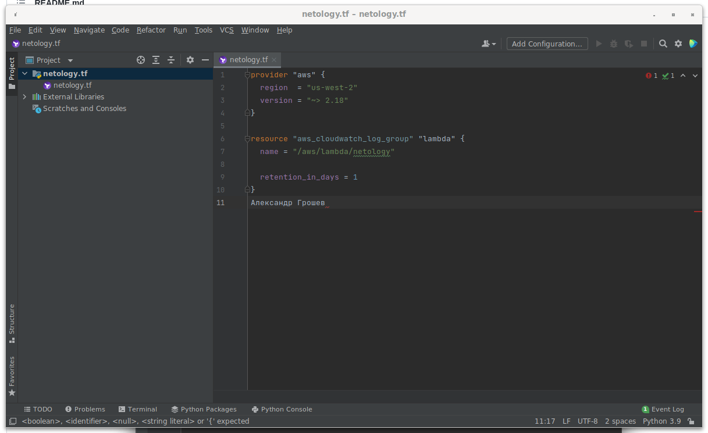
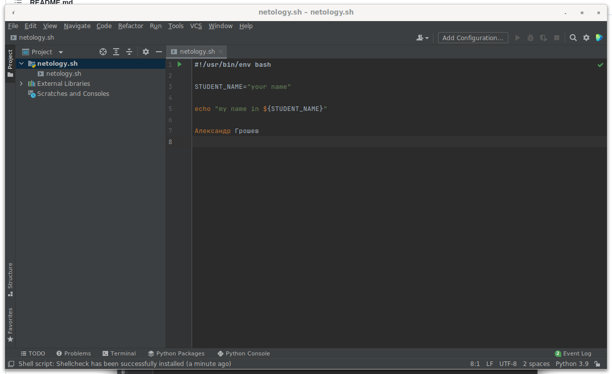
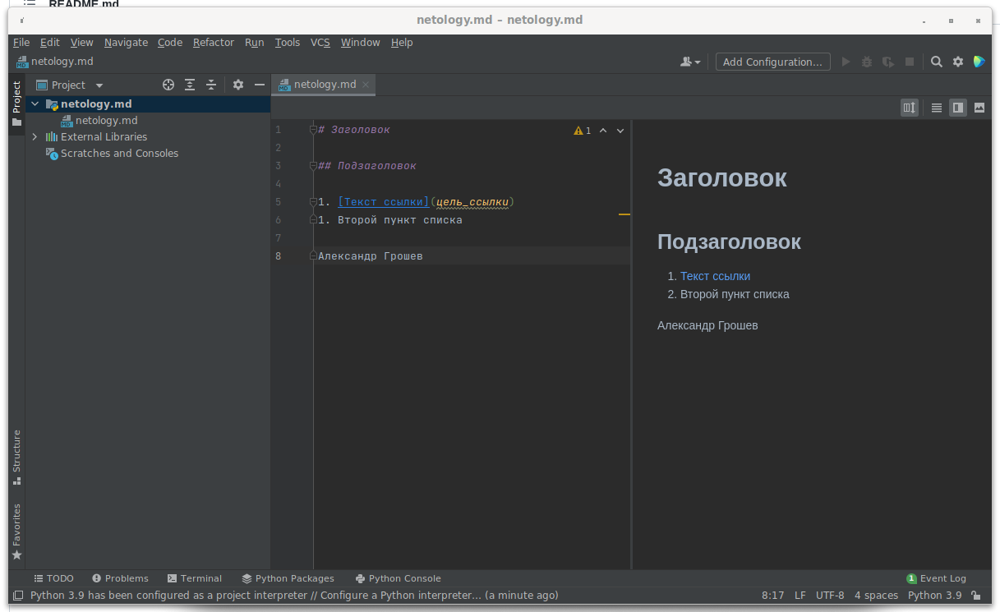
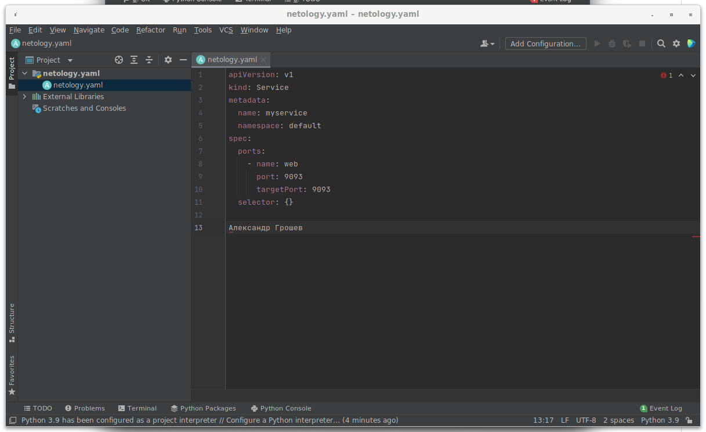
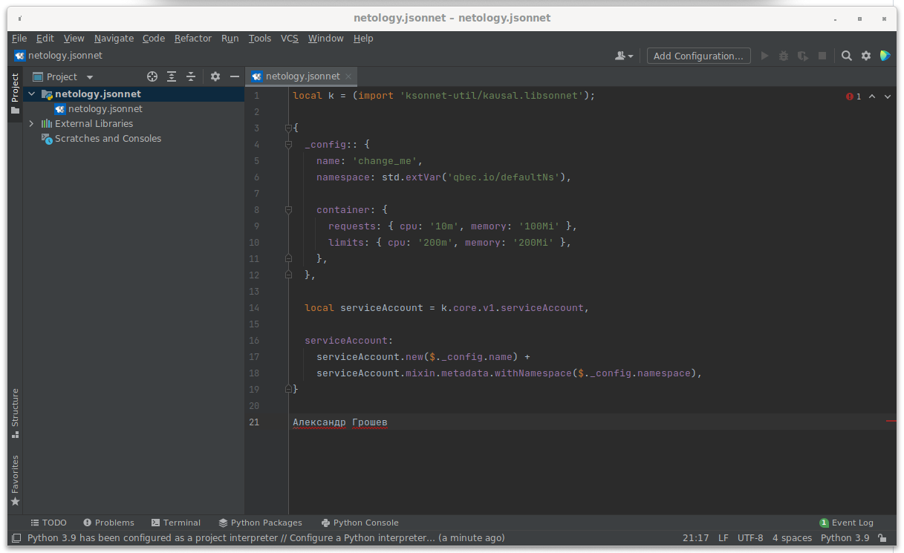

##1. Установка PyCarm  

Ссылки на скриншоты

Terraform:    
Bash:  
Markdown:  
YAML:  
Jsonnet:  

##2. Жизненный цикл задачи

1. Менеджер получает задачу от клиента;
2. Реализация задачи разработчиком;
3. Запуск в тестовой среде.
4. Оценка результатов прохождения тестов. Если тесты пройдены успешно, то задача передаётся менеджеру.
5. Менеджер оценивает результат работы разработчика на соотвествие запросу клиента
6. Приложение доставляется клиенту.

В случае неудачного проходжения пунктов 4,5 задача возвращается разработчику.

DevOps инженер учавствует в выборе инструментов и технологий, автоматизирует вышеперечисленные процессы.

